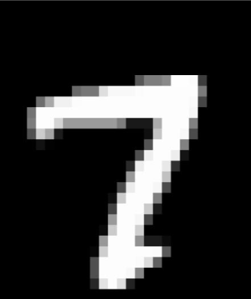

# NumBrain
Handwritten predictive machine
# MNIST-Predictor

## Overview

This project is a handwritten digit recognition system built using a deep learning model based on the MNIST dataset. The system takes a digit image as input and predicts the corresponding digit using a pre-trained neural network. The model is trained on the MNIST dataset, which contains 28x28 pixel images of digits from 0 to 9.

## Features

- **Model Architecture**: The neural network consists of three layers, including two fully connected hidden layers with ReLU activation and an output layer using a sigmoid function.
- **Confusion Matrix**: Visualizes the performance of the model on the test dataset.
- **Real-Time Predictions**: Allows users to input custom digit images in `.png` format, resize them, and predict the digit.

## Installation

To run this project locally, follow these steps:

1. Clone the repository:
    ```bash
    git clone https://github.com/Varun-Ajith/NumBrain.git
    cd MNIST-Predictor
    ```

2. Install the required dependencies:
    ```bash
    pip install -r requirements.txt
    ```

3. Run the model training and prediction code.

## Usage

1. Train the model using the provided code snippet:
    ```python
    model.fit(X_train, Y_train, epochs=10)
    ```

2. Evaluate the model's performance:
    ```python
    loss, accuracy = model.evaluate(X_test, Y_test)
    ```

3. Predict digits from custom images by providing a path to the image file:
    ```python
    input_image_path = input("Enter the path of image : ")
    ```

### Example Input Image

Below is an example of the `.png` image format that the system can recognize:



## How to Add Custom Input

The system allows users to add their own custom `.png` images for prediction. Ensure the input image is resized to 28x28 pixels and in grayscale.

## Confusion Matrix
After evaluating the model, a confusion matrix is displayed to provide insight into the classification accuracy:


## Dependencies
- TensorFlow
- NumPy
- Matplotlib
- Seaborn
- OpenCV
- Keras

## License
This project is licensed under the [Apache 2.0 License](LICENSE). See the LICENSE file for more details.
